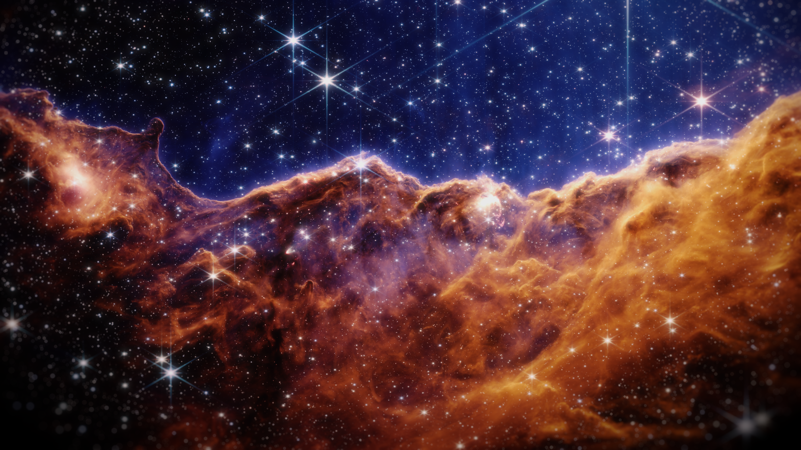
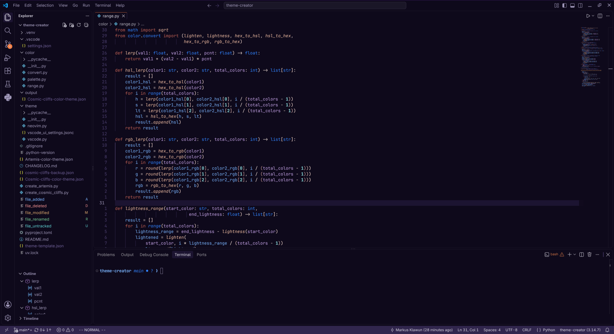

## Cosmic Cliffs VSCode Color Theme

This is a VSCode color theme inspired by the James Webb Space Telescope's "Cosmic Cliffs" image (my own processed version):

    </img>

### Details

So far, this extension is simply a single JSON file containing all of the defined customized colors for the Cosmic Cliffs theme.

    </img>

